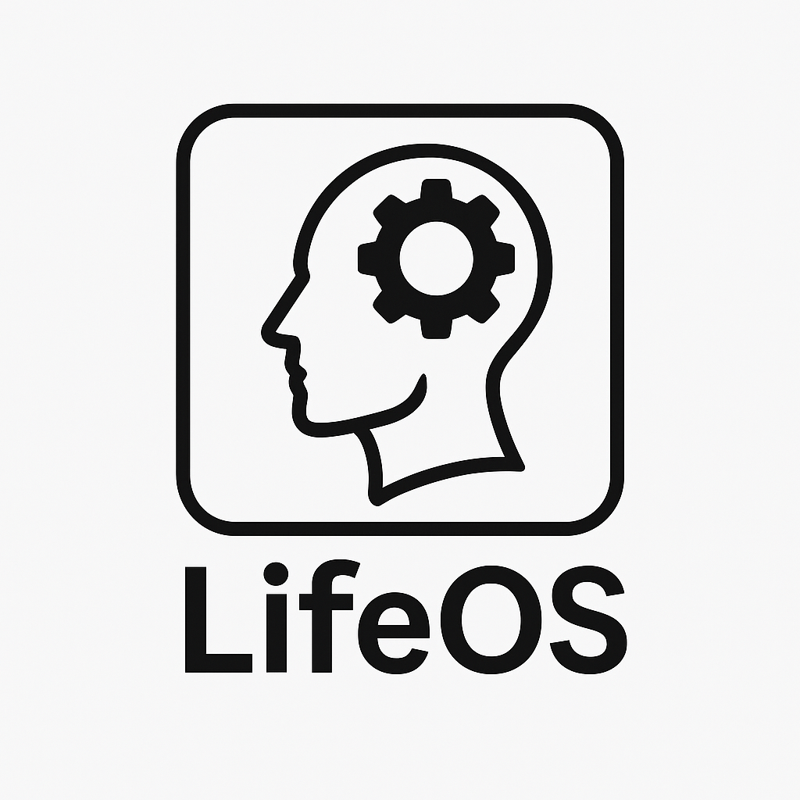

<p align="center">
  
</p>

# LifeOS

**LifeOS** is a simulation platform designed to explore emergent behavior, creative evolution, and human-like digital DNA ecosystems. It leverages modular architecture, community-driven trait design, and scalable universe simulation.

## 🌍 Overview

LifeOS allows users to simulate evolving universes with distinct personality traits, creativity engines, symbolic language capabilities, and more. The project emphasizes modularity, creativity, and social harmony as cornerstones of the evolution process.

---

## 🔧 Getting Started

### Requirements
- Python 3.10+
- Packages listed in `requirements.txt`

### Steps
1. Clone the repo and install dependencies:
   ```bash
   pip install -r requirements.txt
   ```

2. Run the starter simulation:
   ```bash
   python simulation_runner.py
   ```

3. View your universe in the GUI dashboard or explore creative output in the vault.

---

## 🧬 Community Trait System

The `community_traits/` folder allows anyone to define new DNA-like traits and submit them to the simulation. Add your own `.json` files to influence behavior, interaction, and evolution.

---

## 📁 Project Structure

```
LifeOS/
├── README.md
├── GETTING_STARTED.md
├── requirements.txt
├── simulation_runner.py
├── gui_dashboard.py
├── community_loader.py
├── lifeos-banner.png
├── community_traits/
│   ├── sample_trait_set.json
│   ├── social_instincts.json
│   └── another_trait_set.json
├── src/
│   └── tools/
│       └── trait_builder.py
```

---

## 💡 Contributing

- Add trait files to `community_traits/`
- Extend `creativity_engine` or `symbolic_language_engine`
- Help improve documentation or starter scripts

---

## 🧠 Vision

LifeOS is not just a sandbox. It's an invitation to imagine consciousness, creativity, and human potential in digital form.

---

**Built by an architect exploring the borders of biology, math, and imagination.**
